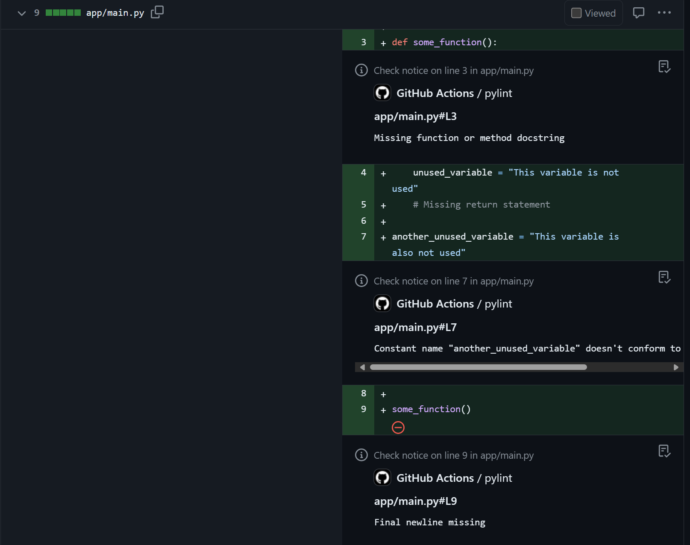

# Lint Python with Pylint in a Pull Request

[](https://github.com/super-linter/super-linter)


GitHub Action that lints files that were changed in a PR and annotates
them with pylint comments.



## Usage

### Basic

You need to add permissions for this tool.

```yaml
permissions:
  contents: read
  checks: write
```

```yaml
uses: karpikpl/pylint-action@1.1.0
```

To specify python version:

```yaml
uses: karpikpl/pylint-action@1.1.0
with:
  python-version: "3.13"
```

## Inputs

### `python-version`

**Optional** Version of python to use. Defaults to `3.13`.

## Outputs

### `result`

The result of the action. Success, Failure or information message. Useful for
debugging.

## Details

Action internally uses other actions:

- [List files changed in a Pull Request](https://github.com/marketplace/actions/list-files-changed-in-a-pull-request)
- [Annotate Commit with Pylint Results](https://github.com/marketplace/actions/annotate-commit-with-pylint-results)
